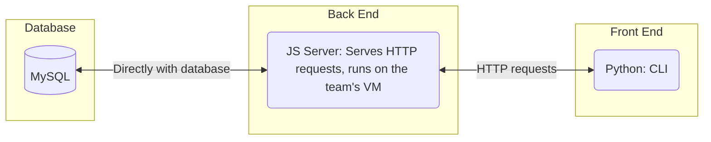
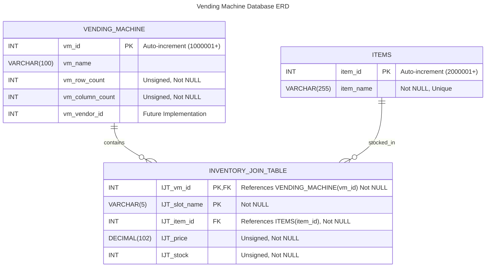

# Specification Document

## 9 Lives

### CI/CD Status

### Project Abstract
This software will, at first, offer a simple command line interface allowing users to simulate the process of purchasing items from the vending machine. We plan to first develop in Python to enable rapid development. If speed becomes an issue, we may refactor the system in C++. From there, we've have multiple ideas tossed around regarding further steps. We think it would be cool to integrate a Raspberry Pi to make a physical vending machine that can actually dispense product.  

The database could hold information of how stocked a vending machine is. It could also contain this information for multiple vending machines. Maybe vendors' information could be kept in a database, and they could login to "restock" the vending machines or collect payment. Speaking of payments, maybe we use the Stripe API to collect payments? Or payments could automatically be routed.  

Additional ideas included making a simple interface for customers to use in the Raspberry Pi. We would probably want the Pi to be running the latest code from main, so Docker would be configured to automatically do so. We can have an automated test suite that any merge requests must pass before being merged -- this could be a hard constraint similar to the "someone else from the team must approve this" already in place.  

Another interface could be provided for vendors to see sales info, stock levels, and to actually add inventory to the machines. This could be a mobile app, a web app, or a desktop app. This would also interface with the database.  

To that end, if we go this route the database would be the connection point between the vending machines and the vendors.  

As is made obvious, the ideas are endless. This document will be updated continuously as decisions are made about the overall system architecture and how far we want to reach. If we have more time, or less time, than expected, these system-wide architectural decisions will be reflected here.  

### Customer
The customer for this software will be customers who would like to purchase an item from the vending machine as well as the vendors who'd like to sell their products in the vending machine. We expect to create two interaces: one for customers to purchase items, and one for vendors to view sales information and restock.

### Specification

#### Technology Stack

#### Database

#### [Class Diagram](docs/architecture.md)

Please follow the link above.

#### Flowchart

### Standards & Conventions

<!--This is a link to a seperate coding conventions document / style guide-->
[Style Guide & Conventions](STYLE.md)
