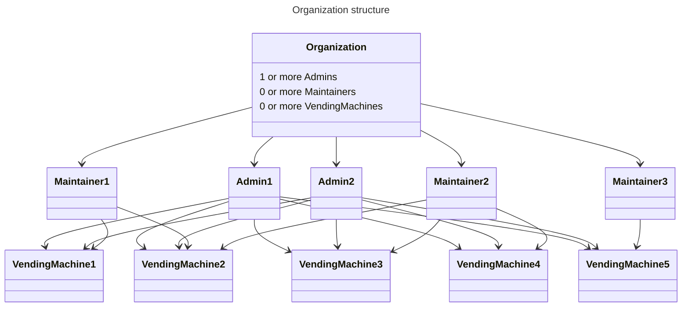
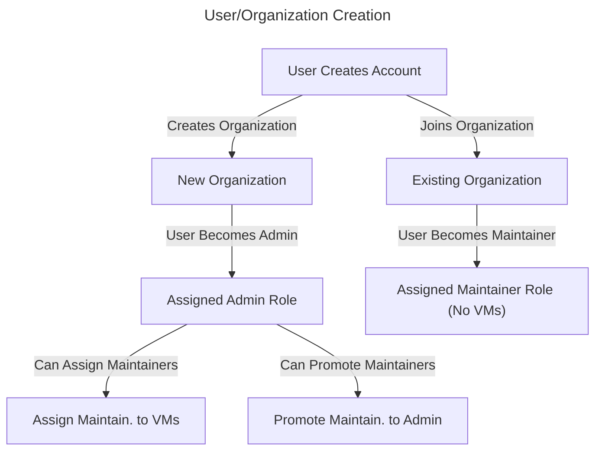
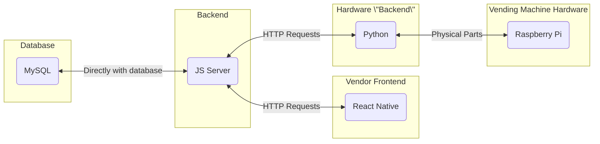
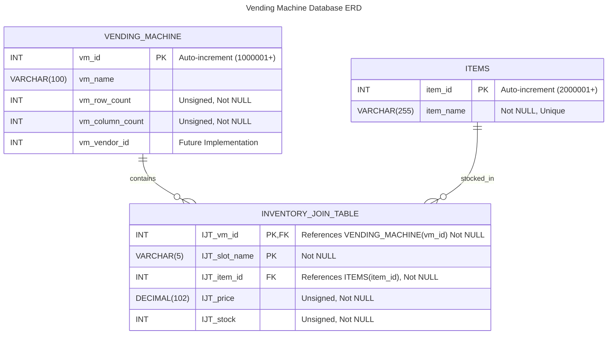
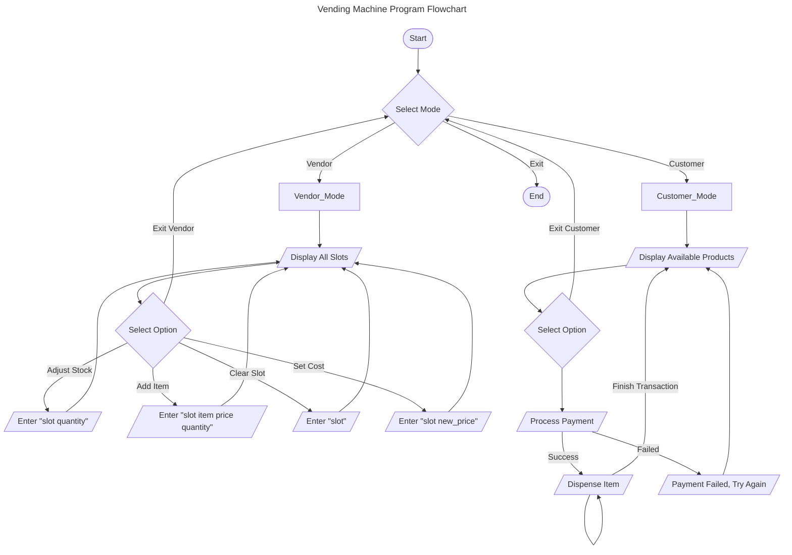

# Specification Document

## 9 Lives

### CI/CD Status

### Project Abstract

After a couple months of hard work, we have successfully reached a point where customers and vendors can fully interact with a simulated vending machine on the command line. This simulation through the command line uses Python for the frontend (aside: we had said originally that if speed became an issue, we would consider refactoring to C++; this has not become an issue). The backend server (which we make HTTP requests to) is a NodeJS server. The database being used is a MySQL database. Both command lines can be run anywhere Docker is installed. All you have to do is clone the repository, navigate to src/client, and run "./startup_docker_container.sh vendor" or "./startup_docker_container.sh vm". Please note, Docker must be running, and you must be connected to the campus VPN.

Running the script with option "vm" simulates the process of viewing the items in a vending machine. This automatically queries the database for items of the vending machine identified by the hardware ID stored in "src/client/customer/configuration.json".

Running the script with option "vendor" simulates the process of restocking a vending machine as a vendor. For example, you can add entirely new items, or you can add more of an item already in the vending machine.

Now that we have the command line interfaces fully integrated with the backend database and server, we are prepared to move forward with a hardware vending machine to be used by customers and a React Native frontend to be used by vendors.

The hardware will dispense a single type of item, like soda cans or chip bags. It will be controlled by a Raspberry Pi, which will use the Python code we've already developed (and is currently used by the vendor command line interface).

The vendor-side application will be a React Native application. This will be hosted on the team's CSL machine.

Once the hardware and vendor-side React application are both implemented, the database will be the only means of communication between the software running on the physical vending machine and vendors restocking or viewing information on the React application.

Each vendor-side user will be associated with an organization. Each organization can have many users. Users will be either an admin or a maintainer. Admins can view information about all vending machines in the organization, while maintainers can only view the information of vending machines which they are assigned to restock by an organization admin. Each organization must have at least 1 admin, but no maintainers are strictly required.

When a user creates an account, they can either create an organization or join an organization. If they create an organization, they will automatically be an admin. If they join an organization, they will automatically be a maintainer assigned to no vending machines. Admins of the organization can promote a new maintainer to be an admin if they choose. Admins also hold the privilege of assigning maintainers to vending machines.

Please see the following diagrams to better understand organization structure and the control flow of adding new users:

### Customer

The customer for this software will be customers who would like to purchase an item from the vending machine as well as the vendors who'd like to sell their products in the vending machine. We have two interaces: one for customers to purchase items, and one for vendors to view sales information and restock.

### Specification

#### Technology Stack

#### Database

#### [Class Diagram](docs/architecture.md)

Please follow the link above.

#### CLI Flowchart

#### Vending Machine FLowchart

TODO: Fill this out once we know a bit more about how the physical vending machine will be interacted with. This should be very similar to the customer half of the flowchart above.

#### Vendor Application Flowchart

TODO: Once more details of the vendor application have been decided upon, this will need to be filled in and a diagram should be created...

for now, here's what we know:
- the user first logs in
- a new user account can be created if the user doesn't yet have a login
- when creating a new user account, the user can either create an organization (and by the admin by default), or they can join an existing organization (and be a maintainer by default -- in this scenario, the admin of the organization can promote them to an admin)
- then the user has a few options...
- If they are an admin, they can view information about all of the organization's vending machines
- If they are a maintainer, they can only view information about the organization's vending machines that they have been assigned to (ones they restock) by an admin

### Standards & Conventions

<!--This is a link to a seperate coding conventions document / style guide-->
[Style Guide & Conventions](STYLE.md)
