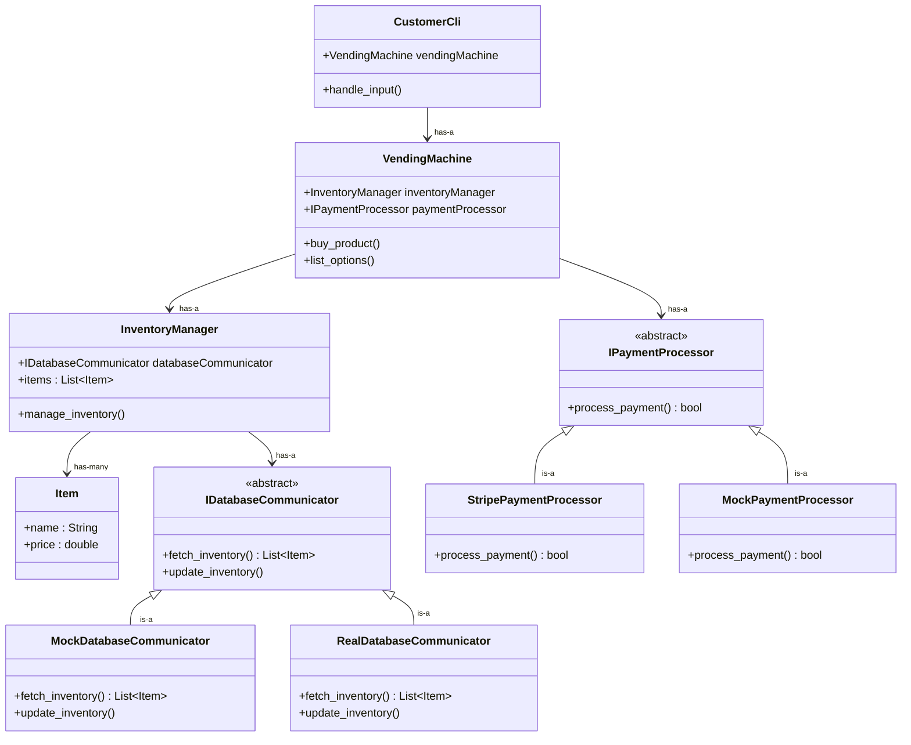

# System Architecture

## Issues with what's here so far and questions about design decisions: 

- **InventoryManager** probably shouldn't manage Items directly. It's probably better for it to query **IDatabaseCommunicator** directly for stock information. **InventoryManager** then acts as a facade that interacts with **IDatabaseCommunicator**.

- Another question is where prices come from. Probably **VendingMachine** should retrieve price data from **InventoryManager**. So then **VendingMachine** doesn't actually have an **IPaymentProcessor**, it just does that through the **InventoryManager**?? Not sure, something to think about

- Overall, need to flush out more details of how the **IDatabaseCommunicator** works.

- How to handle cases when products are out? List them as quantity 0, or just don't list at all. Delete from database whenever quantity reaches 0??

- Even if we don't have a complete vendor-side application, we still need a way to restock. Even if it is a lot simpler, still something to say "add 5 candy bars" or something

- Do we want to have database functionality right now? If not, we could define an abstract base class / interface for database functionality and then just simulate it with file I/O or something for now. Then, we can swap in the actual database interaction implementation once that's ready.

## Design Decision Making Process

First off, we will need a vending machine class: **VendingMachine**. This class's responsibility will be to manage the interaction of different objects and will host a simple interface for using the vending machine (think "buy product" or "list options").

The vending machine will need to hold items, so we create an **Item** class as well. This could be defined in an abstract base class (ABC) if we want different derived types of objects, but that could also be needless complexity. The items will be managed by some object like **InventoryManager**.

To use the database to store inventory information, it probably makes sense for there to be a separate class whose responsibility is communicating with the database: **IDatabaseCommunicator**. In this case, it probably makes sense to define this class's interface in an ABC so a mock object **MockDatabaseCommunicator** can be created for testing purposes. A **RealDatabaseCommunicator** can then actually affect the database.

Our MVP will just use a CLI to manage the vending machine, and there won't be any vendor-side application or interface yet. A class **CustomerCli** can hold an instance of **VendingMachine** and handle interactions via the command line. It will do input validation as well.

As mentioned in #14, a **IPaymentProcessor** ABC should define the behaviors needed to process a payment. Then, there can be two implementations: one called **StripePaymentProcessor** that uses the Stripe API to actually process payments, and another called **MockPaymentProcessor** that can be used for testing or simply when we don't want to be using the API (pre-release).

## Class Design Diagram

