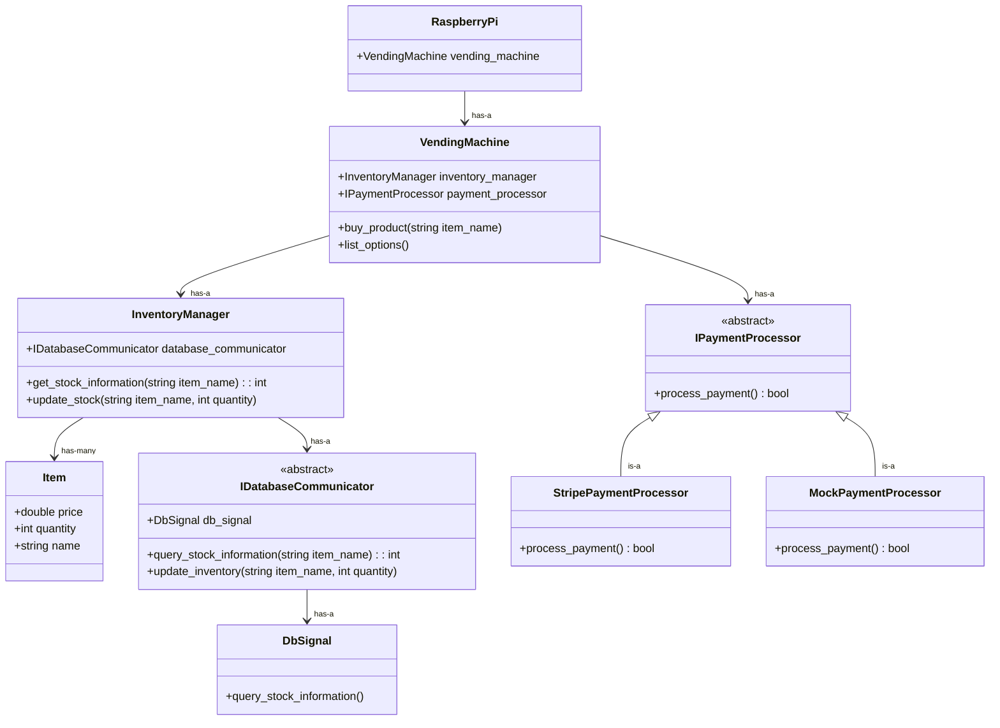
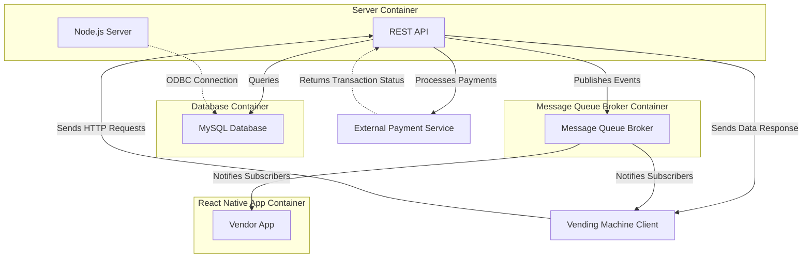

# System Architecture

## Issues with what's here so far and questions about design decisions: 

- Known race condition if multiple users simultaneously try to buy an item with only 1 left in stock.

## Design Decision Making Process

### Frontend

This section discusses the object oriented class design of everything running locally on the vending machine hardware (that is, on the Raspberry Pi). The next section will discuss what runs on the team's virtual machine (backend serving HTTP requests, the database, etc.).

First off, we will need a vending machine class: **VendingMachine**. This class's responsibility will be to manage the interaction of different objects and will host a simple interface for using the vending machine (think "buy product" or "list options").

The vending machine will need to hold items, and this inventory information will be stored in the database.

To use the database to store inventory information, there will be a separate class whose responsibility is communicating with the database: **IDatabaseCommunicator**. In this case, it probably makes sense to define this class's interface in an abstract base class (ABC) so a mock object **MockDatabaseCommunicator** can be created for testing purposes. A **RealDatabaseCommunicator** can then be implemented to actually affect the database.

On top of the **IDatabaseCommunicator** sits a class called **DbSignal** which is used to catch exceptions from the lower layer.

**InventoryManager** sits on top of **DbSignal** to further abstract away some information. For example, the **DbSignal** might have a method query_stock_information(string itemName) that performs the database query (through a call to **IDatabaseCommunicator**), and **InventoryManager** may have a method get_stock_information(string itemName) that then calls the query_stock_information(string itemName) method. **InventoryManager** will be created internally in the **VendingMachine** when **VendingMachine** is constructed.

Once inventory information has been read from the database, the **InventoryManager** will cache that information so it doesn't need to re-query the database every time more information is requested. The cache will hold instances of an **Item** class. Once the transcation is complete, the **InventoryManager** can then write the updated inventory information back to the database again using the **DbSignal** which uses the **IDatabaseCommunicator**.

NOTE: For now, we will ignore the following potential race condition that is presented by this design: imagine two people run the application at the same time. Say there is some item in inventory that has only 1 item left. Both users will have the ability to purchase this item, when in reality only 1 should be allowed. Luckily, once this code is used on the physical vending machine, this race condition goes away because there is only one instance of the application running at a time.

Our MVP, which is now complete, uses a CLI to interface with the vending machine, and there won't be any fancy vendor-side application.

For now, there can be a simple vendor CLI that vendors use to restock the vending machine. In the future, the vendors will use a React Native application for this purpose.

### Backend

This section discusses the backend, comprised of the server serving HTTP requests to the VM using a RESTful API, the MySQL database, the React Native application, and a broker for message queueing.

The server portion will be a NodeJS server. It will use a REST API to handle HTTP requests to port 8080 on cs506x19.cs.wisc.edu. This server will communicate directly with the database. There will be one container for the MySQL database and one container for the server, but they will be running on the same Docker network.

The server's primary job is to serve HTTP requests regarding database queries.

The server will also have a single API endpoint for processing payments. This way, the vending machine client can send a request, and the server (holding the secret API key) will perform the payment transaction. We don't want to put the secret key on all of our client's machines, as that is a big security fault. Though security isn't a big issue for this project, this vulternability is easy enough to avoid. 

This structure allows us to communicate with the database without using port forwarding. Rather, we can just make standard HTTP requests so long as we are connected to the campus VPN, since port 8080 is exposed on the campus network.

The backend will also host the React Native application -- this is in the early stages, so there is more yet to come.

Finally, the backend holds a broker for message queueing. Without getting too complex, it essentially allows the backend server to post messages to a specific topic in this broker. Then, the broker alerts subscribers to that topic. This way, a vendor on the React application will automatically be updated whenever a customer makes a purchase.

## Class Design Diagram

NOTE: The functions inside each class are just provided as example functionality of what each class may do. As each class gets developed, we can investigate and define each class's interface more thoughtfully. This document can be used as a guide when determining the single responsibility of each class, and to understand how other classes may interact with one another.

### Vending Machine

### Backend

