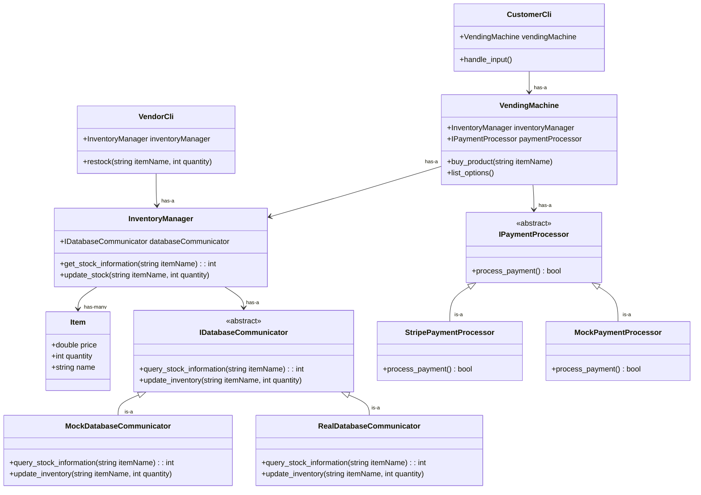

# System Architecture

## Issues with what's here so far and questions about design decisions: 

- Where prices come from. Presumably, **VendingMachine** should retrieve price data from **InventoryManager**. So then **VendingMachine** will have to get pricing info from **InventoryManager** and then somehow send that to **IPaymentProcessor**

- Overall, need to flush out more details of how the **IDatabaseCommunicator** works.

- How to handle cases when products are out? List them as quantity 0, or just don't list at all. Delete from database whenever quantity reaches 0??

- Known race condition if multiple users simultaneously try to buy an item with only 1 left in stock.

## Design Decision Making Process

First off, we will need a vending machine class: **VendingMachine**. This class's responsibility will be to manage the interaction of different objects and will host a simple interface for using the vending machine (think "buy product" or "list options").

The vending machine will need to hold items, and this inventory information will be stored in the database.

To use the database to store inventory information, it probably makes sense for there to be a separate class whose responsibility is communicating with the database: **IDatabaseCommunicator**. In this case, it probably makes sense to define this class's interface in an abstract base class (ABC) so a mock object **MockDatabaseCommunicator** can be created for testing purposes. A **RealDatabaseCommunicator** can then be implemented to actually affect the database.

It is proposed that there is a class, **InventoryManager**, that sits on top of **IDatabaseCommunicator** to further abstract away some information. For example, the **IDatabaseCommunicator** might have a method query_stock_information(string itemName) that performs the database query, and **InventoryManager** may have a method get_stock_information(string itemName) that then calls the query_stock_information(string itemName) method.

Once inventory information has been read from the **IDatabaseCommunicator**, the **InventoryManager** will cache that information in some sort of data structure so it doesn't need to re-query the database every time more information is requested. The data structure will hold instances of an **Item** class. Once the transcation is complete, the **InventoryManager** can then write the updated inventory information back to the database again using the **IDatabaseCommunicator**.

NOTE: For now, we will ignore the following potential race condition that is presented by this design: imagine two people run the application at the same time. Say there is some item in inventory that has only 1 item left. Both users will have the ability to purchase this item, when in reality only 1 should be allowed. This is a known potential issue that we will worry about later.

Our MVP will just use a CLI to interface with the vending machine, and there won't be any fancy vendor-side application. A class **CustomerCli** can hold an instance of **VendingMachine** and handle interactions via the command line. It will do input validation as well.

For now, there can be a simple **VendorCli** that holds a reference to the same **InventoryManager** object that **VendingMachine** holds a reference to. The **VendorCli** can implement simple methods for restocking the vending machine.

As mentioned in #14, a **IPaymentProcessor** ABC should define the behaviors needed to process a payment. Then, there can be two implementations: one called **StripePaymentProcessor** that uses the Stripe API to actually process payments, and another called **MockPaymentProcessor** that can be used for testing or simply when we don't want to be using the API (pre-release).

## Class Design Diagram

