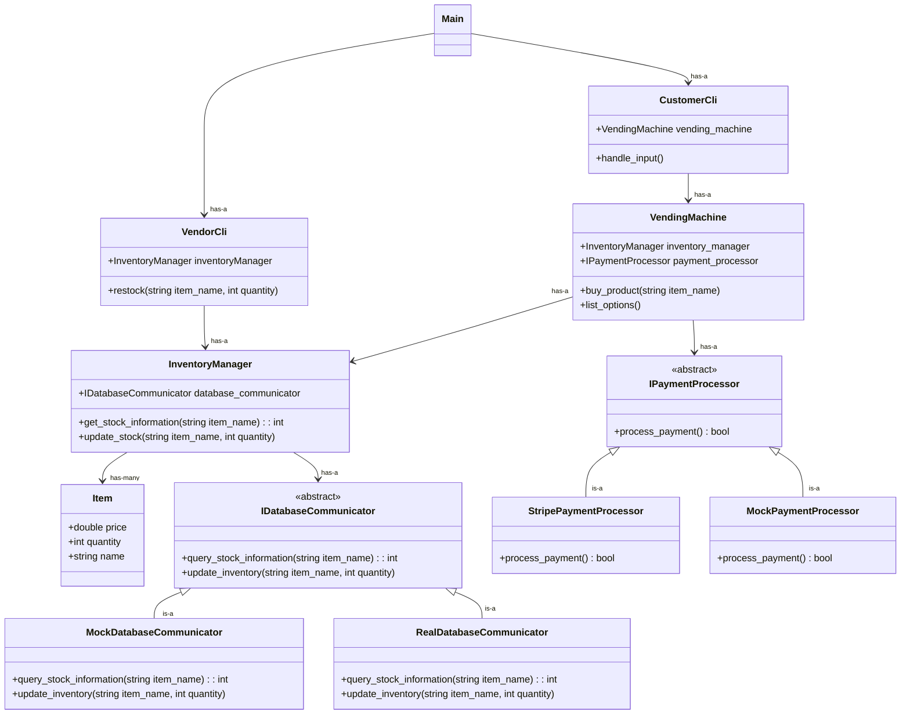
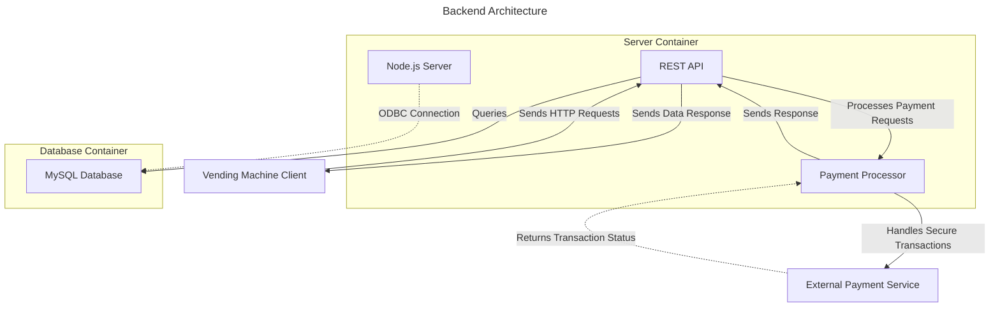

# System Architecture

## Issues with what's here so far and questions about design decisions: 

- Overall, need to flush out more details of how the **IDatabaseCommunicator** works.

- How to handle cases when products are out? List them as quantity 0, or just don't list at all. Delete from database whenever quantity reaches 0??

- Known race condition if multiple users simultaneously try to buy an item with only 1 left in stock.

## Design Decision Making Process

### Frontend

This section discusses the object oriented class design of everything running locally on the user's device. The next section will discuss what runs on the team's virtual machine (backend serving HTTP requests and the database).

First off, we will need a vending machine class: **VendingMachine**. This class's responsibility will be to manage the interaction of different objects and will host a simple interface for using the vending machine (think "buy product" or "list options").

The vending machine will need to hold items, and this inventory information will be stored in the database.

To use the database to store inventory information, it probably makes sense for there to be a separate class whose responsibility is communicating with the database: **IDatabaseCommunicator**. In this case, it probably makes sense to define this class's interface in an abstract base class (ABC) so a mock object **MockDatabaseCommunicator** can be created for testing purposes. A **RealDatabaseCommunicator** can then be implemented to actually affect the database.

It is proposed that there is a class, **InventoryManager**, that sits on top of **IDatabaseCommunicator** to further abstract away some information. For example, the **IDatabaseCommunicator** might have a method query_stock_information(string itemName) that performs the database query, and **InventoryManager** may have a method get_stock_information(string itemName) that then calls the query_stock_information(string itemName) method. **InventoryManager** will be passed as a reference to the **VendingMachine** when **VendingMachine** is constructed.

Once inventory information has been read from the **IDatabaseCommunicator**, the **InventoryManager** will cache that information in some sort of data structure so it doesn't need to re-query the database every time more information is requested. The data structure will hold instances of an **Item** class. Once the transcation is complete, the **InventoryManager** can then write the updated inventory information back to the database again using the **IDatabaseCommunicator**.

NOTE: For now, we will ignore the following potential race condition that is presented by this design: imagine two people run the application at the same time. Say there is some item in inventory that has only 1 item left. Both users will have the ability to purchase this item, when in reality only 1 should be allowed. This is a known potential issue that we will worry about later.

Our MVP will just use a CLI to interface with the vending machine, and there won't be any fancy vendor-side application. A class **CustomerCli** can hold an instance of **VendingMachine** and handle interactions via the command line. It will do input validation as well. Following dependency injection reasoning, the **CustomerCli** should take the **VendingMachine** object as a reference at construction.

For now, there can be a simple **VendorCli** that holds a reference to the same **InventoryManager** object that **VendingMachine** holds a reference to. The **VendorCli** can implement simple methods for restocking the vending machine. Again following dependency injection reasoning, the **VendorCli** should take the **InventoryManger** object as a reference at construction.

As mentioned in #14, a **IPaymentProcessor** ABC should define the behaviors needed to process a payment. Then, there can be two implementations: one called **StripePaymentProcessor** that uses the Stripe API to actually process payments, and another called **MockPaymentProcessor** that can be used for testing or simply when we don't want to be using the API (pre-release).

In order to enable dependency injection (following the dependency inversion principle), a **Main** class will be used. There are a three purposes for having this class.

First, it will create all of *our* objects (so classes described in this document, but not things like Strings). This way, if any object creations throw exceptions, the **Main** class can handle those exceptions, rather than the exceptions being thrown through multiple layers of constructors. 

Second, the **Main** class can take a single boolean variable that states whether we are in simulation/testing mode or operation mode. When in simulation mode, mocked objects, like the **MockDatabaseCommunicator** and **MockPaymentProcessor** classes, can be created and passed into their respective "has-a" owners, **InventoryManager** and **VendingMachine**. This means that owner classes, like **InventoryManger** and **VendingMachine**, can operate without having to know or care which implementations of **IDatabaseCommunicator** and **MockPaymentProcessor** they are actually using. Additionally, the "is this simulation/testing or real operation" "switching" logic only has to be implemented once -- we wouldn't want every class to have a boolean variable passed into it conditionally choosing between objects.

Now is an appropriate time to explain how the **Main** class will work: First, it creates all the necessary objects (selecting between mock and real objects as necessary). For now, in the MVP which utilizes a simple **VendorCli** instead of a separate vendor applicatino, the **Main** class will have a main control loop. First, the control loop asks whether the user is a vendor or a customer. Then, it runs the respective Cli. Like the rest of the objects, the Vendor and Customer Cli objects will have their required objects, **InventoryManager** and **VendingMachine**, injected into them. This gives us "inside access" to the **InventoryManger** without needing to propogate vendor-side methods all the way through the **VendingMachine** when they'll only be removed after the MVP is complete.

Hence, the third purpose arises. Once we move on from our MVP, we will no longer need the **VendorCli**. Instead of refactoring multiple layers of code (like removing vendor-side methods from **VendingMachine**), all we have to do is remove the option to select "vendor" from the control loop (instead sending straight to the **CustomerCli**), and delete the **VendorCli** object creation in **Main**.

### Backend

In this section, we discuss the backend, comprised of the server serving HTTP requests to the VM using a RESTful API as well as the database itself.

The server portion will be written in js. It will use a REST API to handle HTTP requests to port 8080 on cs506x19.cs.wisc.edu. This server will communicate directly with the database. They may be running in the same container, but more likely will be running in separate containers -- one container for the MySQL database, one container for the server.

The server's primary job is to serve HTTP requests regarding database queries. The server will use some sort of ODBC to communicate with the database.

The server will also have a single API endpoint for processing payments. This way, the vending machine client can send a request, and the server (holding the secret API key) will perform the payment transaction. We don't want to put the secret key on all of our client's machines, as that is a big security fault. Though security isn't a big issue for this project, this vulternability is easy enough to avoid. 

The goal of this structure is to be able to communicate with the database through this method so we don't need to use port forwarding (ssh -L ...) as was done in DevTech2. 

We also won't use PhpMyAdmin for this (which was used in DevTech2).

## Class Design Diagram

NOTE: The functions inside each class are just provided as example functionality of what each class may do. As each class gets developed, we can investigate and define each class's interface more thoughtfully. This document can be used as a guide when determining the single responsibility of each class, and to understand how other classes may interact with one another.

### Frontend

### Backend

